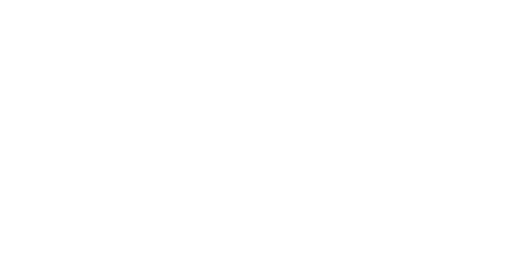

```{r setup, include=FALSE}
knitr::opts_chunk$set(echo = TRUE)
```

## Problem 1

\[
P(\lambda_{ia} | Y_{ia}, Y_{0a}, n_{ia}, n_{0a}) \propto P(Y_{ia} | \lambda_{ia}) P(\lambda_{ia} | Y_{0a}, n_{0a}).
\]


\[
P(\lambda_{ia} | Y_{ia}, Y_{0a}, n_{ia}, n_{0a}) \propto \left( \frac{(n_{ia} \lambda_{ia})^{Y_{ia}} e^{-n_{ia} \lambda_{ia}}}{Y_{ia}!} \right) \times \left( \frac{n_{0a}^{Y_{0a}}}{\Gamma(Y_{0a})} \lambda_{ia}^{Y_{0a} - 1} e^{-n_{0a} \lambda_{ia}} \right).
\]

Removing anything that doesn't depend on \( \lambda_{ia} \):

\[
P(\lambda_{ia} | Y_{ia}, Y_{0a}, n_{ia}, n_{0a}) \propto \lambda_{ia}^{Y_{ia}} e^{-n_{ia} \lambda_{ia}} \cdot \lambda_{ia}^{Y_{0a} - 1} e^{-n_{0a} \lambda_{ia}}.
\]

\[
\propto \lambda_{ia}^{(Y_{ia} + Y_{0a}) - 1} e^{-(n_{ia} + n_{0a}) \lambda_{ia}}.
\]

Thus, the full conditional for \( \lambda_{ia} \) is:

\[
P(\lambda_{ia} | Y_{ia}, Y_{0a}, n_{ia}, n_{0a}) \sim \text{Gamma}(Y_{0a} + Y_{ia}, n_{0a} + n_{ia}).
\]

## Problem 2

$Y_{0a}$ and $n_{0a}$ represent the prior death count and prior population size for age group a respectively because the parameters for the full conditional (Gamma) distribution of \( \lambda_{ia} \) are $Y_{0a} + Y_{ia}$ and $n_{0a} + n_{ia}$, reflecting that the death count starts at $Y_{0a}$ and is added to as new data comes in and the population size starts at $n_{0a}$ and is added to as new data comes in.

## Problem 3

$n_{0a} = 10000 * \pi_a$ is the correct value to reflect a prior with the weight of a county with 10000 people across all of the age groups considered because it's the share of 10000 people that we would expect to be in age group a, and $Y_{0a} = n_{0a}\lambda_{0a}$ is the correct value because it is the expected number of deaths within this age group given the value of $n_{0a}$ that we just calculated and the initial guess for $\lambda_{0a}$.

## Problem 4

One way we can account for this censored data without breaking the conjugacy of our prior is by using the inverse transform method to individually impute the values of $Y_{ia}$ the suppressed counties. This involves sampling from a uniform distribution (between 0 and 1) and finding $Y_{ia}^*$ (the imputed value) using the inverse of the CDF for a Poisson below the calculation threshold, which in this case is the lowest $Y_{ia}^*$ for which $\sum_{y=0}^{Y_{ia}^*} P(Y_{ia} = y | \lambda_{ia}) \geq u P(Y_{ia} < 10 | \lambda_{ia})$ where $u$ is the sample drawn from the uniform distribution. This is done within a Gibbs Sampler so the most revent values of $Y_{ia}$ and $\lambda_{ia}$ are used.

## Problem 5

The full hierarchical model is:

$P(\lambda_{ia}, Y_{ia}^* | Y_{ia} \geq 10, n_{ia}, Y_{0a}, n_{0a}) \propto P(Y_{ia} | \lambda_{ia}) P(Y_{ia}^* | \lambda_{ia}) P(\lambda_{ia} | Y_{0a}, n_{0a})$

## Problems 6 and 7

Map:



Code:

```{r, eval=FALSE}
#https://wonder.cdc.gov/controller/saved/D140/D34F844
rm(list=ls())
#First we read in the data and define a few things...
stroke=read.table('2016_PA_stroke_total.txt',sep='\t',
                  stringsAsFactors=FALSE,header=TRUE)
Ng=3        #three age groups
alabs=unique(stroke$Age.Group.Code)
Ns=67     #67 counties
clabs=unique(stroke$County)

#Next we organize things a bit...
Y=array(stroke$Deaths,dim=c(Ng,Ns))
n=array(stroke$Population,dim=c(Ng,Ns))

###################
###################
#per part 4, all Y's below 10 have been suppressed
###################
thres=10      #Suppression threshold
dY=!is.na(Y)  #0 for suppressed, 1 for observed
nsupp=apply(!dY,1,sum) #how many suppressed per age
#note: we do not know the true Y's
#      CDC did the suppression, not me

###################
###################
#insert your prior info here
###################
lam0=c(75,250,1000)/100000
total_pop = sum(n)
age_proportions = apply(n, 1, sum) / total_pop
n0= age_proportions * 10000
Y0= n0 * lam0

###################
###################
#initialize your Gibbs sampler here
nsims=10000
lami=array(dim=c(Ng,Ns,nsims))
for(a in 1:Ng){
  lami[a,,1]= lam0[a]
  Y[a,!dY[a,]]= Y0[a]
  #Note: the preceding line assumes we don't care
  #      what the posterior dist of the missing
  #      Y's looks like -- I'm just plugging the
  #      current guesses directly into my data vector
}

for(it in 2:nsims){
  for(a in 1:Ng){
    ###################
    ###################
    #ADDRESS SUPPRESSED Y HERE
    ###################
    ###################
    
    for(i in 1:Ns){  
      if(!dY[a, i]){  # Only update suppressed Y values
        lambda_curr = lami[a, i, it-1]  # Use last iteration's lambda
        
        # Truncated Poisson sampling via inverse transform
        p_cdf = ppois(9, lambda_curr * n[a, i])  # CDF for Y < 10
        u = runif(1) * p_cdf  # Scale uniform draw
        Y[a, i] = qpois(u, lambda_curr * n[a, i])  # Get truncated Poisson sample
      }
    }

    ###################
    ###################
    #ESTIMATE LAMBDA_{ia} HERE
    ###################
    ###################
    
    for(i in 1:Ns){  
      Y_total = Y[a, i]  # Includes imputed values
      lami[a, i, it] = rgamma(1, shape = Y0[a] + Y_total, rate = n0[a] + n[a, i])
    }
  }
}

#################
#################
#Get posterior samples
#of the age-adjusted rates
#################
aalami=array(dim=c(Ns,nsims))
std_pop = apply(n, 1, sum)  # Total population in each age group across all counties
w_a = std_pop / sum(std_pop)  # Compute weights for age adjustment
for(i in 1:Ns){
  aalami[i,]= colSums(w_a * lami[, i, ])  # Vectorized sum across age groups
}

##################
##################
#calculate the posterior medians
# of the age-adjusted rates
aa.med= apply(aalami, 1, median)

##################
##################
#THE BELOW CODE SHOULD BE LEFT AS-IS!
#IT ASSUMES YOU NAMED
#THE POSTERIOR MEDIANS OF THE AGE-ADJUSTED RATES
#"aamed" USING THE CODE ABOVE,
#AND WILL CREATE A MAP "PAmap.png"
#THAT WILL BE SAVED TO YOUR CURRENT DIRECTORY
##################

install.packages(c("sp", "rgdal", "rgeos", "maps", "RColorBrewer")) # I added this to install packages that I needed

load('penn.rdata')
install.packages(c('maps','RColorBrewer'))
library(maps)
library(RColorBrewer)
ncols=7
cols=brewer.pal(ncols,'RdYlBu')[ncols:1]
tcuts=quantile(aa.med*100000,1:(ncols-1)/ncols)
tcolb=array(rep(aa.med*100000,each=ncols-1) > tcuts,
            dim=c(ncols-1,Ns))
tcol =apply(tcolb,2,sum)+1

png('PAmap.png',height=520,width=1000)
par(mar=c(0,0,0,10),cex=1)
    plot(penn,col=cols[tcol],border='lightgray',lwd=.5)
    legend('right',inset=c(-.15,0),xpd=TRUE,
           legend=c(paste(
           c('Below',round(tcuts[-(ncols-1)],0),'Over'),
           c(' ',rep( ' - ',ncols-2),' '),
           c(round(tcuts,0),round(tcuts[ncols-1],0)),sep='')),
           fill=cols,title='Deaths per 100,000',bty='n',cex=1.5,
           border='lightgray')
dev.off()
```


