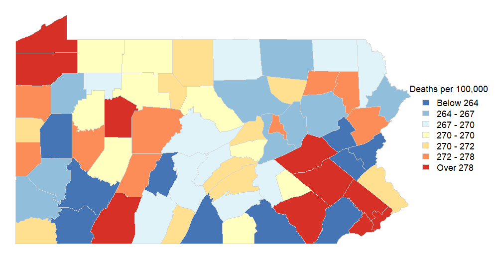

```{r setup, include=FALSE}
knitr::opts_chunk$set(echo = TRUE)
```

## Problem 1

The full hierarchical model is:

\[
P(\beta_{0a}, \sigma_a^2, \theta_{ia} | Y) \propto P(Y | \lambda) P(\lambda | \theta) P(\theta | \beta_{0a}, \sigma_a^2) P(\beta_{0a}) P(\sigma_a^2).
\]

where

\[
P(Y_{ia} | \lambda_{ia}) = \frac{(n_{ia} e^{\theta_{ia}})^{Y_{ia}} e^{-n_{ia} e^{\theta_{ia}}}}{Y_{ia}!}.
\]

\[
P(\theta_{ia} | \beta_{0a}, \sigma_a^2) = \frac{1}{\sqrt{2\pi \sigma_a^2}} e^{-\frac{(\theta_{ia} - \beta_{0a})^2}{2\sigma_a^2}}.
\]

\[
P(\beta_{0a}) = \frac{1}{\sqrt{2\pi \tau_a^2}} e^{-\frac{\beta_{0a}^2}{2\tau_a^2}}.
\]

\[
P(\sigma_a^2) = \frac{b_0^{a_0}}{\Gamma(a_0)} (\sigma_a^2)^{-a_0-1} e^{-b_0 / \sigma_a^2}.
\]

## Problem 2

Full Conditional for $\theta_{ia}$:

\[
P(\theta_{ia} | Y, \beta_{0a}, \sigma_a^2) \propto e^{Y_{ia} \theta_{ia} - n_{ia} e^{\theta_{ia}}} e^{-\frac{(\theta_{ia} - \beta_{0a})^2}{2\sigma_a^2}}.
\]

This requires the use of Metropolis steps because it's not of the same form as its prior.

Full Conditional for $\beta_{0a}$:

\[
P(\beta_{0a} | \theta, \sigma_a^2) \propto \prod_{i=1}^{Ns} e^{-\frac{(\theta_{ia} - \beta_{0a})^2}{2\sigma_a^2}} e^{-\frac{\beta_{0a}^2}{2\tau_a^2}}.
\]

\[
\beta_{0a} | \theta, \sigma_a^2 \sim \mathcal{N} \left( \frac{\sum_{i=1}^{Ns} \theta_{ia} / \sigma_a^2}{Ns / \sigma_a^2 + 1 / \tau_a^2}, \frac{1}{Ns / \sigma_a^2 + 1 / \tau_a^2} \right).
\]

This can be sampled from directly because it's of the same form as its prior.

Full Conditional for $\sigma_{a}^2$:

\[
P(\sigma_a^2 | \theta, \beta_{0a}) \propto (\sigma_a^2)^{-\frac{Ns}{2}-a_0-1} e^{-\frac{b_0 + \frac{1}{2} \sum_{i=1}^{Ns} (\theta_{ia} - \beta_{0a})^2}{\sigma_a^2}}.
\]

\[
\sigma_a^2 | \theta, \beta_{0a} \sim \text{Inverse-Gamma} \left( a_0 + \frac{Ns}{2}, b_0 + \frac{1}{2} \sum_{i=1}^{Ns} (\theta_{ia} - \beta_{0a})^2 \right).
\]

This can be sampled from directly because it's of the same form as its prior.

## Problem 3

Map:



Code:

```{r}
#https://wonder.cdc.gov/controller/saved/D140/D34F844
rm(list=ls())
#First we read in the data and define a few things...
stroke=read.table('2016_PA_stroke_total.txt',sep='\t',
                  stringsAsFactors=FALSE,header=TRUE)
Ng=3        #three age groups
alabs=unique(stroke$Age.Group.Code)
Ns=67     #67 counties
clabs=unique(stroke$County)

#Next we organize things a bit...
Y=array(stroke$Deaths,dim=c(Ng,Ns))
n=array(stroke$Population,dim=c(Ng,Ns))

###################
###################
#per part 4, all Y's below 10 have been suppressed
###################
thres=10      #Suppression threshold
dY=!is.na(Y)  #0 for suppressed, 1 for observed
nsupp=apply(!dY,1,sum) #how many suppressed per age
#note: we do not know the true Y's
#      CDC did the suppression, not me

###################
#insert your prior info here
###################
lam0=c(75,250,1000)/100000
total_pop = sum(n)
age_proportions = apply(n, 1, sum) / total_pop
n0= age_proportions * 10000
Y0= n0 * lam0
tau_a2 = 10000  # Variance for beta_0a prior
a0 = 0.001  # For inverse-gamma prior on sigma_a^2
b0 = 0.001  # For inverse-gamma prior on sigma_a^2

###################
# Initialize Gibbs sampler
###################
nsims=10000
lami=array(dim=c(Ng,Ns,nsims))
theta=array(dim=c(Ng,Ns,nsims))  # Store theta_ia samples
beta_0a=matrix(0, nrow=Ng, ncol=nsims)  # Store beta_0a samples
sigma_a2=matrix(1, nrow=Ng, ncol=nsims)  # Store sigma_a^2 samples

# Initialize values
for(a in 1:Ng){
  theta[a,,1]= log(lam0[a])  # Initialize theta_ia using prior mean
  beta_0a[a,1] = 0
  sigma_a2[a,1] = 1
  Y[a,!dY[a,]]= Y0[a]  # Impute missing Y values with prior expectation
}

###################
# Gibbs Sampler Loop
###################
for(it in 2:nsims){
  for(a in 1:Ng){
    
    ###################
    # Address suppressed Y
    ###################
    for(i in 1:Ns){  
      if(!dY[a, i]){  
        lambda_curr = exp(theta[a, i, it-1])  
        p_cdf = ppois(9, lambda_curr * n[a, i])  
        u = runif(1) * p_cdf  
        Y[a, i] = qpois(u, lambda_curr * n[a, i])  
      }
    }
    
    ###################
    # Sample theta_ia using Metropolis
    ###################
    for(i in 1:Ns) {
      theta_proposed = rnorm(1, mean = theta[a, i, it - 1], sd = 0.1)
      
      log_r = Y[a, i] * theta_proposed - n[a, i] * exp(theta_proposed) -
        (Y[a, i] * theta[a, i, it - 1] - n[a, i] * exp(theta[a, i, it - 1])) -
        ((theta_proposed - beta_0a[a, it - 1])^2 / (2 * sigma_a2[a, it - 1])) +
        ((theta[a, i, it - 1] - beta_0a[a, it - 1])^2 / (2 * sigma_a2[a, it - 1]))
      
      if (log(runif(1)) < log_r) {
        theta[a, i, it] = theta_proposed
      } else {
        theta[a, i, it] = theta[a, i, it - 1]
      }
    }
    
    ###################
    # Sample beta_0a from Normal
    ###################
    var_beta = 1 / (Ns / sigma_a2[a, it - 1] + 1 / tau_a2)
    mean_beta = var_beta * sum(theta[a, , it] / sigma_a2[a, it - 1])
    beta_0a[a, it] = rnorm(1, mean = mean_beta, sd = sqrt(var_beta))
    
    ###################
    # Sample sigma_a^2 from Inverse-Gamma
    ###################
    shape_new = a0 + Ns / 2
    scale_new = b0 + sum((theta[a, , it] - beta_0a[a, it])^2) / 2
    sigma_a2[a, it] = 1 / rgamma(1, shape = shape_new, rate = scale_new)
    
    ###################
    # Compute lambda_ia
    ###################
    for(i in 1:Ns){  
      lami[a, i, it] = exp(theta[a, i, it])
    }
  }
}

##################
# Calculate posterior medians
##################
burnin = 2500
beta_0a_med = apply(beta_0a[, (burnin+1):nsims], 1, median)
theta_med = apply(theta[, , (burnin+1):nsims], c(1,2), median)
aa.med = apply(lami[, , (burnin+1):nsims], c(2), median)

##################
# Diagnostic Plots
##################
par(mfrow = c(2, 3))

plot(beta_0a[1, ], type = 'l', main = expression(beta[0][1]), xlab = "Iteration", ylab = expression(beta[0][1]))
abline(v = burnin, col = "red", lty = 2)
plot(beta_0a[2, ], type = 'l', main = expression(beta[0][2]), xlab = "Iteration", ylab = expression(beta[0][2]))
abline(v = burnin, col = "red", lty = 2)
plot(beta_0a[3, ], type = 'l', main = expression(beta[0][3]), xlab = "Iteration", ylab = expression(beta[0][3]))
abline(v = burnin, col = "red", lty = 2)


```

```{r}
par(mfrow = c(2, 3))
random_county = sample(1:Ns, 1)
plot(theta[1, random_county, ], type = 'l', main = expression(theta[1]), xlab = "Iteration", ylab = expression(theta[1]))
abline(v = burnin, col = "red", lty = 2)
plot(theta[2, random_county, ], type = 'l', main = expression(theta[2]), xlab = "Iteration", ylab = expression(theta[2]))
abline(v = burnin, col = "red", lty = 2)
plot(theta[3, random_county, ], type = 'l', main = expression(theta[3]), xlab = "Iteration", ylab = expression(theta[3]))
abline(v = burnin, col = "red", lty = 2)

```

```{r,eval=FALSE}
##################
##################
#THE BELOW CODE SHOULD BE LEFT AS-IS!
#IT ASSUMES YOU NAMED
#THE POSTERIOR MEDIANS OF THE AGE-ADJUSTED RATES
#"aamed" USING THE CODE ABOVE,
#AND WILL CREATE A MAP "PAmap.png"
#THAT WILL BE SAVED TO YOUR CURRENT DIRECTORY
##################
load('penn.rdata')
install.packages(c('maps','RColorBrewer'))
library(maps)
library(RColorBrewer)
ncols=7
cols=brewer.pal(ncols,'RdYlBu')[ncols:1]
tcuts=quantile(aa.med*100000,1:(ncols-1)/ncols)
tcolb=array(rep(aa.med*100000,each=ncols-1) > tcuts,
            dim=c(ncols-1,Ns))
tcol =apply(tcolb,2,sum)+1

png('PAmap.png',height=520,width=1000)
par(mar=c(0,0,0,10),cex=1)
plot(penn,col=cols[tcol],border='lightgray',lwd=.5)
legend('right',inset=c(-.15,0),xpd=TRUE,
       legend=c(paste(
         c('Below',round(tcuts[-(ncols-1)],0),'Over'),
         c(' ',rep( ' - ',ncols-2),' '),
         c(round(tcuts,0),round(tcuts[ncols-1],0)),sep='')),
       fill=cols,title='Deaths per 100,000',bty='n',cex=1.5,
       border='lightgray')
dev.off()
```


