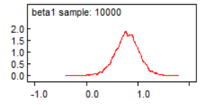
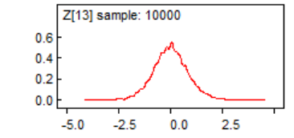
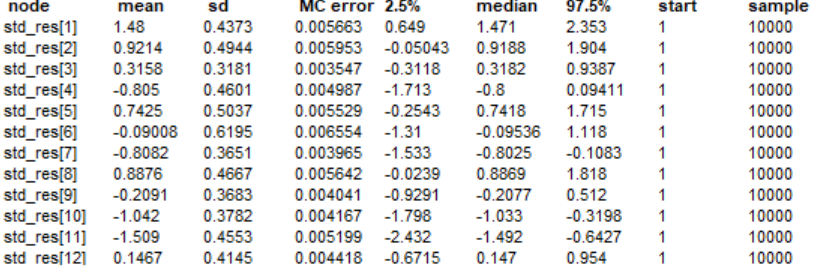

```{r setup, include=FALSE}
knitr::opts_chunk$set(echo = TRUE)
```

## Problem 1

Yes, a linear model appears plausible for this relationship given the plot below.

```{r}
patient <- 1:12
before <- c(102.4, 103.2, 101.9, 103.0, 101.2, 100.7, 102.5, 103.1, 102.8, 102.3, 101.9, 101.4)
after  <- c(99.6, 100.1, 100.2, 101.1, 99.8, 100.2, 101.0, 100.1, 100.7, 101.1, 101.3, 100.2)

Z <- before - after

df <- data.frame(patient, before, after, reduction = Z)

plot(df$before, df$reduction,
     main = "Temperature Reduction vs. Initial Temperature",
     xlab = "Initial Temperature (Before)",
     ylab = "Reduction (After - Before)",
     pch = 19, col = "blue")
abline(h = 0, lty = 2, col = "gray")  
```

## Problem 2

The median value of $\beta_1$ is 0.7942. The 95% credible interval is $[0.2991,1.257]. This confirms the inverstigators' suspicion that there is a nonzero relationship between the temperature before taking aspirin and the drop in temperature after taking aspirin for children with influenza. The DIC is 25.281. Dbar is 22.145. pD is 3.136. The posterior density estimate is below.



The model specifications, data, and initial values are as follows:

model {
  for (i in 1:n) {
    Z[i] ~ dnorm(mu[i], tau)
    mu[i] <- beta0 + beta1 * X[i]
  }
  
  beta0 ~ dnorm(0, 0.0001)
  beta1 ~ dnorm(0, 0.0001)
  tau ~ dgamma(0.1, 0.1)  # Precision has Gamma prior
}

list(
  n=12,
  X = c(102.4, 103.2, 101.9, 103.0, 101.2, 100.7, 102.5, 103.1, 102.8, 102.3, 101.9, 101.4),
  Z = c(2.8, 3.1, 1.7, 1.9, 1.4, 0.5, 1.5, 3.0, 2.1, 1.2, 0.6, 1.2)
)

list(beta0 = 0, beta1 = 0, tau = 1)


## Problem 3

The probability that $Z_13$ is greater than 0 is calculated below using its samples exported from WinBUGS.

```{r}
samples_df <- read.table("z13_samples.txt", header = FALSE)

z13_samples <- samples_df$V2

prob_z13_gt_0 <- mean(z13_samples > 0)

cat("P(Z[13] > 0) =", prob_z13_gt_0, "\n")

```

The posterior density of $Z_{13}$ is shown below. The median is -0.004623.



## Problem 4

The stats for the standardized residuals are shown below. None of them seem to be outliers as none are above or below 2 standard deviations from the mean.



The CPO is calculated below.

```{r}
Z <- c(2.8, 3.1, 1.7, 1.9, 1.4, 0.5, 1.5, 3.0, 2.1, 1.2, 0.6, 1.2)
mu_raw <- read.table("mu_samples.txt", header = FALSE)
tau_raw <- read.table("tau_samples.txt", header = FALSE)
tau_samples <- tau_raw[, 2]
S <- length(tau_samples)
n <- length(Z)
mu_values <- mu_raw[, 2]
mu_matrix <- matrix(mu_values, nrow = S, ncol = n)
lik_matrix <- matrix(NA, nrow = S, ncol = n)
for (i in 1:n) {
  lik_matrix[, i] <- sqrt(tau_samples / (2 * pi)) * exp(-0.5 * tau_samples * (Z[i] - mu_matrix[, i])^2)
}
cpo <- 1 / colMeans(1 / lik_matrix)
plot(cpo, type = "h", main = "CPO by Observation", ylab = "CPO", xlab = "Index")


```

1st observation:

```{r}
print(cpo[1])
```
11th observation:

```{r}
print(cpo[11])
```

Those are the smallest values, but they do not indicate outlier status.

## Problem 5

The new DIC value is 26.803 (Dbar = 22.512, pD = 4.291), which is higher than that of the linear model, suggesting that we should not add the quadratic term.

The new $Z_{13}$ samples have a median of 0.9353. This is very different from the previous median. This may no longer be a valid prediction because x=100 is far away from the domain of the rest of the data.


