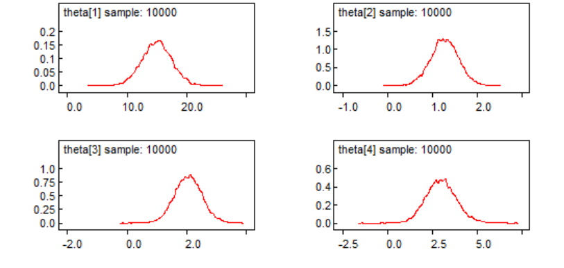
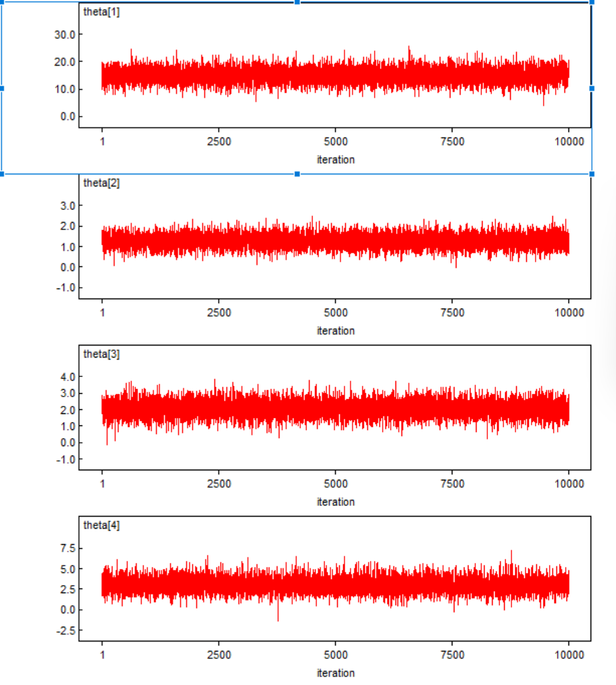
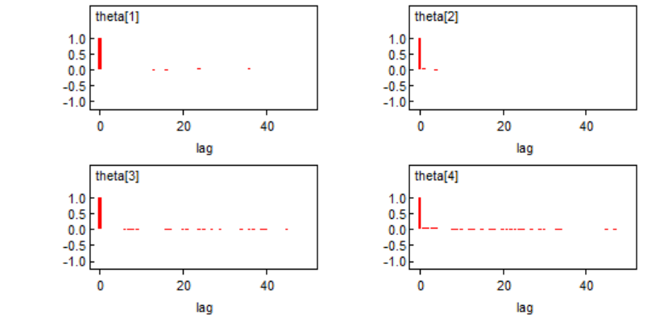
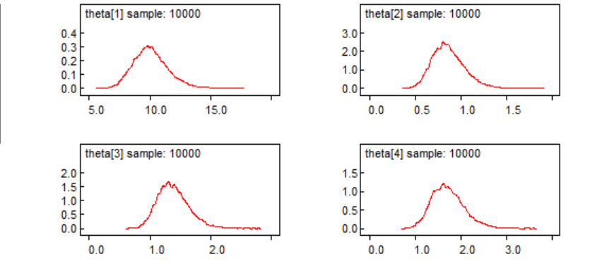
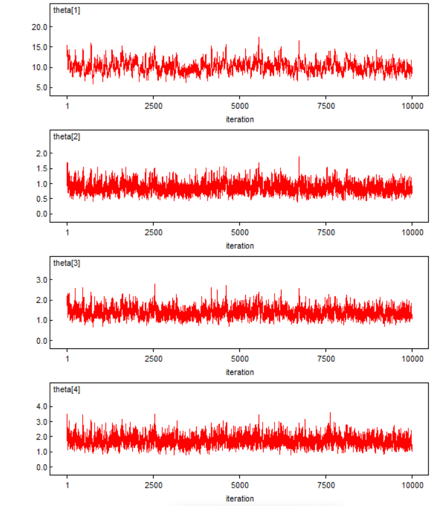
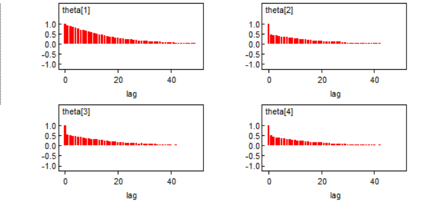

```{r setup, include=FALSE}
knitr::opts_chunk$set(echo = TRUE)
```

## Problem 1

The multivariate normal parameter $\theta$ is used to estimate the mean number of urinary incontinences at baseline, three months, six months, and 12 months. The hyperparameter mu should be a vector of four zeros since we aren't given any prior knowledge about the mean for each time point. The hyperparameter Omega should be a four by four matrix with small positive values (0.0001) on the diagonal and zeros on the off diagonal in order to have a small but nonzero prior precision which gives us a vague but proper prior. The Wishart parameter $\tau$ is used to estimate the precision, corresponding to an inverse Wishart being used to estimate the variance. The hyperparameter R is a four by four matrix with small positive values (0.0001) on the diagonal and zeros on the off diagonal in order to have a small but nonzero prior precision which gives us a vague but proper prior. The hyperparamater $\rho$ should be four so that it meets the minimum threshold for the Wishart prior to be proper in four dimensions but does not make it any more informative than it has to be.

## Problem 2

This model did not run initially because WinBUGS said that not all model variables were initialized. It ran when I used "gen inits" instead of "load inits". The values I got were slightly different than those in the assignment description, possibly as a result of this. They are shown below.

X[6,4]: Median = 0.99 and 95% CI = [-5.213,5.434]

X[10,4]: Median = 1.031 and 95% CI = [-5.551,7.438]

theta[1]: Median = 15.03 and 95% CI = [10.07,20.02]

theta[2]: Median = 1.276 and 95% CI = [0.6706,1.887]

theta[3]: Median = 2.047 and 95% CI = [1.151,3.009]

theta[4]: Median = 2.998 and 95% CI = [1.394,4.719]

## Problem 3

The same problem occurred with the initial values as before, and it ran when using gen inits. Here are the results:

X[6,4]: Median = 0.06703 and 95% CI = [-5.142,5.387]

X[10,4]: Median = 1.022 and 95% CI = [-5.283,7.535]

theta[1]: Median = 15.04 and 95% CI = [10.08,20.01]

theta[2]: Median = 1.268 and 95% CI = [0.6371,1.889]

theta[3]: Median = 2.048 and 95% CI = [1.128,2.975]

theta[4]: Median = 2.994 and 95% CI = [1.328,4.781]

## Problem 4

### Part a

$\alpha$ and $\beta$ are defined as follows:

`a <- (theta[3] - theta[1]) / theta[1]
`b <- (theta[4] - theta[1]) / theta[1]

The same issue with loading initial values remains and was resolved by using gen inits. The results are:

X[6,4]: Median = 0.1008 and 95% CI = [-5.189,5.291]

X[10,4]: Median = 0.92 and 95% CI = [-5.37,7.559]

theta[1]: Median = 15.02 and 95% CI = [10.1,19.91]

theta[2]: Median = 1.276 and 95% CI = [0.6591,1.897]

theta[3]: Median = 2.056 and 95% CI = [1.141,2.979]

theta[4]: Median = 2.987 and 95% CI = [1.409,4.758]

a: Median = -0.8631 and 95% CI = [-0.9234,-0.7806]

b: Median = -0.8018 and 95% CI = [-0.8958,-0.6872]

The values of X[6,4] and X[10,4] differ significantly from the previous two models.

```{r}
alpha <- read.table("a.txt")[, 2]
beta <- read.table("b.txt")[, 2]
correlation <- cor(alpha, beta)
cat("Posterior correlation between alpha and beta:", correlation, "\n")
```

This is not a concerning amount of correlation given that we would expect some correlation because $\alpha$ and $\beta$ are measuring the change in overlapping time periods.

### Part b

Three ways to diagnose convergence problems are a kernel density plot, a history plot, and an autocorrelation function. Those for theta are shown below.







The kernel density should look to be normally distributed, the history plot should look like white noise around the estimate (possibly after some burn in), and the autocorrelation function should have small values other than at 0. All seem to be the case here.

### Part c

As in the previous models, the values for patients 6 and 10 at 12 months are slightly off from those in the assignment description, but not unreasonably so. This may be due to the use of gen inits instead of loading the initial values as described. In a real world sense, it doesn't make sense that these confidence intervals include 0 because the number of occurrences cannot be below 0 in real life.

## Problem 5

### Part a

$\alpha$ and $\beta$ are defined as follows:

`a <- (theta[3] - theta[1]) / theta[1]
`b <- (theta[4] - theta[1]) / theta[1]

The same issue with loading initial values remains and was resolved by using gen inits. The results are:

X[6,4]: Median = 1.191 and 95% CI = [-0,4]

X[10,4]: Median = 0.7238 and 95% CI = [0,3]

theta[1]: Median = 9.978 and 95% CI = [7.572,13.32]

theta[2]: Median = 0.8478 and 95% CI = [0.5691,1.26]

theta[3]: Median = 1.362 and 95% CI = [0.9488,1.953]

theta[4]: Median = 1.688 and 95% CI = [1.108,2.521]

a: Median = -0.8631 and 95% CI = [-0.8952,-0.8251]

b: Median = -0.8307 and 95% CI = [-0.8784,-0.7712]


```{r}
alpha <- read.table("a2.txt")[, 2]
beta <- read.table("b2.txt")[, 2]
correlation <- cor(alpha, beta)
cat("Posterior correlation between alpha and beta:", correlation, "\n")
```

This is not a concerning amount of correlation, even smaller than the amount in the previous model, given that we would expect some correlation because $\alpha$ and $\beta$ are measuring the change in overlapping time periods.

### Part b

Again, here are the kernel density plot, history plot, and autocorrelation function for theta.







The kernel density should look to be normally distributed, the history plot should look like white noise around the estimate (possibly after some burn in), and the autocorrelation function should have small values other than at 0. In this case, there is a concerning amount of autocorrelation for all values of theta.

### Part c

In this case, the model generates values that are much further away from those in the assignment description for both patient 6 and patient 10, but the confidence intervals align better with the real-world context because the lower bound for both is 0.

