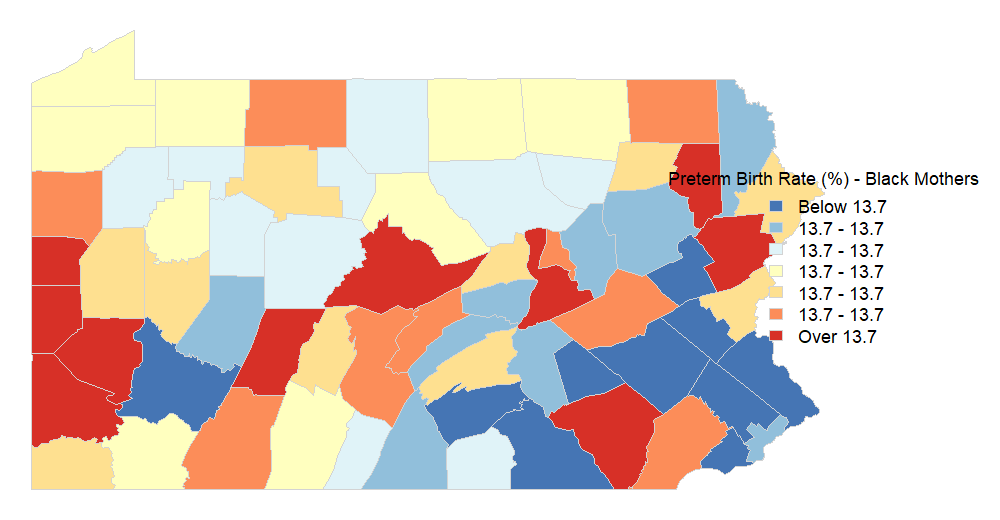
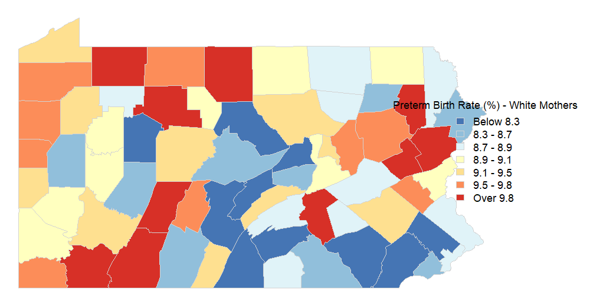
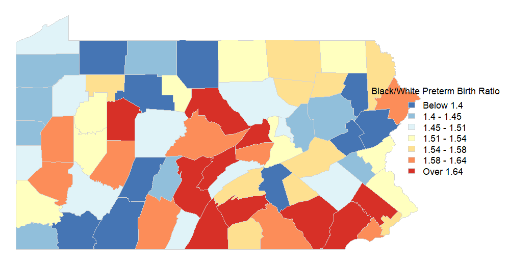

```{r setup, include=FALSE}
knitr::opts_chunk$set(echo = TRUE)
```

## Problem 1

The rate of preterm births for Black mothers is 13.7% while that of White mothers is 8.83%. This difference is significant at all levels when using a two sided Z test.

```{r}
rm(list=ls())
#First we read in the data and define a few things...
load(file='midterm_data.rdata')
list2env(mdata,envir=sys.frame(sys.nframe()))

Ns=dim(Y)[1] #67 counties
Ng=dim(Y)[2] #2 races being considered

#################
#Y is a 67x2 array of the number of preterm births
#  in PA counties by Black mothers vs. White mothers
par(mfrow=c(2,2))
ylims=quantile(Y,0:1); ybrks=seq(ylims[1],ylims[2],length.out=20)
hist(Y[,1],main='Preterm Births: Black Mothers',breaks=ybrks)
hist(Y[,2],main='Preterm Births: White Mothers',breaks=ybrks)
#################
#n is a 67x2 array of the number of total births
#  in PA counties by Black mothers vs. White mothers
nlims=quantile(n,0:1); nbrks=seq(nlims[1],nlims[2],length.out=20)
hist(n[,1],main='Total Births: Black Mothers',breaks=nbrks)
hist(n[,2],main='Total Births: White Mothers',breaks=nbrks)

total_preterm_black = sum(Y[,1])
total_preterm_white = sum(Y[,2])

total_births_black = sum(n[,1])
total_births_white = sum(n[,2])

preterm_rate_black = (total_preterm_black / total_births_black) * 100
preterm_rate_white = (total_preterm_white / total_births_white) * 100

disparity = preterm_rate_black - preterm_rate_white

cat("Preterm birth rate for Black mothers:", round(preterm_rate_black, 2), "%\n")
cat("Preterm birth rate for White mothers:", round(preterm_rate_white, 2), "%\n")

prop.test(x = c(total_preterm_black, total_preterm_white), 
          n = c(total_births_black, total_births_white), 
          alternative = "two.sided")

```


## Problem 2

\[
p (\beta_0, \theta, \sigma, Y_c | Y_o, d) \propto \prod_{i,r} \text{Bin} (Y_{ir} | n_{ir}, \pi_{ir}) \times \mathcal{N} (\theta_{ir} | \beta_{0r}, \sigma_r^2) \times \mathcal{N} (\beta_{0r} | 0, \tau^2) \times \text{IG} (\sigma_r^2 | 0.001, 0.001)
\]

## Problem 3

\[
p(\beta_{0r} | \theta, \sigma_r^2, Y) \propto p(\theta | \beta_{0r}, \sigma_r^2) p(\beta_{0r})
\]

\[
p(\beta_{0r} | \theta, \sigma_r^2) \sim \mathcal{N} \left( \mu_{\beta_{0r}}, V_{\beta_{0r}} \right)
\]

\[
V_{\beta_{0r}} = \left( \frac{N_s}{\sigma_r^2} + \frac{1}{\tau^2} \right)^{-1}
\]

\[
\mu_{\beta_{0r}} = V_{\beta_{0r}} \sum_{i} \frac{\theta_{ir}}{\sigma_r^2}
\]

This is normally distributed as is its prior and it can be sampled from directly.

\[
p(\theta_{ir} | Y_{ir}, n_{ir}, \beta_{0r}, \sigma_r^2) \propto p(Y_{ir} | \theta_{ir}) p(\theta_{ir} | \beta_{0r}, \sigma_r^2)
\]

\[
p(Y_{ir} | \theta_{ir}) \propto \pi_{ir}^{Y_{ir}} (1 - \pi_{ir})^{n_{ir} - Y_{ir}}, \quad \pi_{ir} = \text{logit}^{-1}(\theta_{ir})
\]

\[
p(\theta_{ir} | \beta_{0r}, \sigma_r^2) \sim \mathcal{N}(\beta_{0r}, \sigma_r^2)
\]

\[
p(\sigma_r^2 | \theta, \beta_{0r}) \propto p(\theta | \beta_{0r}, \sigma_r^2) p(\sigma_r^2)
\]

\[
p(\theta | \beta_{0r}, \sigma_r^2) \propto (\sigma_r^2)^{-N/2} \exp \left( -\frac{1}{2\sigma_r^2} \sum_{i} (\theta_{ir} - \beta_{0r})^2 \right)
\]

This does not fit into a standard distribution and bust be sampled using the Metropolis algorithm.

\[
p(\sigma_r^2) \propto (\sigma_r^2)^{-(0.001 + 1)} \exp \left( -\frac{0.001}{\sigma_r^2} \right)
\]

\[
\sigma_r^2 | \theta, \beta_{0r} \sim \text{Inverse-Gamma} \left( 0.001 + \frac{N}{2}, 0.001 + \frac{1}{2} \sum_{i} (\theta_{ir} - \beta_{0r})^2 \right)
\]

This is an inverse gamma distribution as is its prior and it can be sampled from directly.

## Problem 4

It was not clear what to do in the case of no data for race $r$ in county $i$ to estimate $\theta_{ir}$. I used the estimate for $\beta_{0r}$ in its place because it makes sense to use the expected value of the distribution if there is no data to base it on.

I used 1000 samples of burn-in. This is primarily because of the variance for Black women, the other parameters that were plotted stabilized relatively quickly.

```{r}
tau2 = 10000   
as = bs = 0.001 

nsims = 10000
beta0 = matrix(0, nrow=Ng, ncol=nsims) 
sig2 = matrix(1, nrow=Ng, ncol=nsims)  
theta = array(0, dim=c(Ns, Ng, nsims)) 
q_theta = array(1, dim=c(Ns, Ng))      
accept_count = array(0, dim=c(Ns, Ng)) 

for (r in 1:Ng) {
  for (i in 1:Ns) {
    theta[i, r, 1] = 0 
  }
}

for (it in 2:nsims) {
  for (r in 1:Ng) {
    
    V_beta0 = (Ns / sig2[r, it-1] + 1 / tau2) ^ (-1)
    mu_beta0 = V_beta0 * sum(theta[, r, it-1] / sig2[r, it-1])
    beta0[r, it] = rnorm(1, mean=mu_beta0, sd=sqrt(V_beta0))
    
    for (i in 1:Ns) {
      if (n[i, r] == 0) {
        theta[i, r, it] = beta0[r, it]
      } else {
        theta_old = theta[i, r, it-1]
        theta_prop = rnorm(1, mean=theta_old, sd=sqrt(q_theta[i, r]))
        
        pi_prop = exp(theta_prop) / (1 + exp(theta_prop))
        pi_old = exp(theta_old) / (1 + exp(theta_old))
        
        pi_prop <- min(max(pi_prop, 1e-6), 1-1e-6)
        pi_old <- min(max(pi_old, 1e-6), 1-1e-6)
        
        log_r = Y[i, r] * (theta_prop - theta_old) +
          n[i, r] * (log(1 + exp(theta_old)) - log(1 + exp(theta_prop))) +
          (-0.5 / max(sig2[r, it-1], 1e-6)) * ((theta_prop - beta0[r, it])^2 - (theta_old - beta0[r, it])^2)
        
        accept = log(runif(1)) < log_r
        
        if (accept) {
          theta[i, r, it] = theta_prop
          accept_count[i, r] = accept_count[i, r] + 1 
        } else {
          theta[i, r, it] = theta_old
        }
      }
    }
    
    shape = as + Ns / 2
    scale = bs + 0.5 * sum((theta[, r, it] - beta0[r, it])^2)
    sig2[r, it] = 1 / rgamma(1, shape, scale)
  }
  
  if (it %% 100 == 0) {
    for (r in 1:Ng) {
      for (i in 1:Ns) {
        acc_rate = accept_count[i, r] / 100  
        accept_count[i, r] = 0  
        q_theta[i, r] = q_theta[i, r] * ifelse(acc_rate > 0.75, 1.2, ifelse(acc_rate < 0.2, 0.8, 1))
      }
    }
  }
}

burnin = 1:1000
beta0_post = beta0[, -burnin]
sig2_post = sig2[, -burnin]
theta_post = theta[, , -burnin]

par(mfrow=c(1, 2))

matplot(t(beta0_post), type='l', lty=1, col=1:Ng, main="Trace Plot of Beta0", xlab="Iteration", ylab=expression(beta[0]))
legend("topright", legend=paste("Race", 1:Ng), col=1:Ng, lty=1, cex=0.8)
matplot(t(sig2_post), type='l', lty=1, col=1:Ng, main="Trace Plot of Sigma^2", xlab="Iteration", ylab=expression(sigma^2))
legend("topright", legend=paste("Race", 1:Ng), col=1:Ng, lty=1, cex=0.8)


apply(beta0_post, 1, mean)
apply(sig2_post, 1, mean)
```

## Problem 5

\[
\gamma_1 = \beta_{01} - \beta_{02}
\]

There is a significant disparity, $\gamma_1 > 0$ at all significance levels.

```{r}
gamma1_post = beta0_post[1, ] - beta0_post[2, ]  # Difference in beta_0 values

x_min = min(gamma1_post, 0)  
x_max = max(gamma1_post, 0) 

gamma1_lower = quantile(gamma1_post, 0.025)
gamma1_upper = quantile(gamma1_post, 0.975)

hist(gamma1_post, breaks=30, col="lightblue", border="black",
     main="Posterior Distribution of Log Odds Ratio (Black vs. White)",
     xlab=expression(gamma[1]), probability=TRUE, xlim=c(x_min, x_max))

lines(density(gamma1_post), col="darkblue", lwd=2)

abline(v=gamma1_lower, col="red", lwd=2, lty=2)
abline(v=gamma1_upper, col="red", lwd=2, lty=2)

p_gamma1_positive = mean(gamma1_post > 0)
cat(sprintf("P(gamma1 > 0): %.4f\n", p_gamma1_positive))

```

## Problem 6

### Preterm Birth Rate for Black Mothers


### Preterm Birth Rate for White Mothers


### Black/White Ratio of Preterm Birth Rates


```{r,eval =FALSE}
load('penn.rdata')
library(maps)
library(RColorBrewer)

pi_black = apply(theta_post[,1,], 1, function(x) mean(exp(x) / (1 + exp(x)))) * 100

# Define color scale
ncols=7
cols=brewer.pal(ncols, 'RdYlBu')[ncols:1]
tcuts=quantile(pi_black, 1:(ncols-1)/ncols)
tcolb=array(rep(pi_black, each=ncols-1) > tcuts, dim=c(ncols-1, Ns))
tcol = apply(tcolb, 2, sum) + 1

# Generate Map
png('PAmap_pi_black.png', height=520, width=1000)
par(mar=c(0,0,0,10), cex=1)
plot(penn, col=cols[tcol], border='lightgray', lwd=0.5)
legend('right', inset=c(-.15,0), xpd=TRUE,
       legend=c(paste(c('Below', round(tcuts[-(ncols-1)], 1), 'Over'),
                      c(' ', rep(' - ', ncols-2), ' '),
                      c(round(tcuts, 1), round(tcuts[ncols-1], 1)), sep='')),
       fill=cols, title='Preterm Birth Rate (%) - Black Mothers', bty='n', cex=1.5,
       border='lightgray')
dev.off()
```

```{r,eval=FALSE}
pi_white = apply(theta_post[,2,], 1, function(x) mean(exp(x) / (1 + exp(x)))) * 100

# Define color scale
ncols=7
cols=brewer.pal(ncols, 'RdYlBu')[ncols:1]
tcuts=quantile(pi_white, 1:(ncols-1)/ncols)
tcolb=array(rep(pi_white, each=ncols-1) > tcuts, dim=c(ncols-1, Ns))
tcol = apply(tcolb, 2, sum) + 1

# Generate Map
png('PAmap_pi_white.png', height=520, width=1000)
par(mar=c(0,0,0,10), cex=1)
plot(penn, col=cols[tcol], border='lightgray', lwd=0.5)
legend('right', inset=c(-.15,0), xpd=TRUE,
       legend=c(paste(c('Below', round(tcuts[-(ncols-1)], 1), 'Over'),
                      c(' ', rep(' - ', ncols-2), ' '),
                      c(round(tcuts, 1), round(tcuts[ncols-1], 1)), sep='')),
       fill=cols, title='Preterm Birth Rate (%) - White Mothers', bty='n', cex=1.5,
       border='lightgray')
dev.off()
```

```{r,eval=FALSE}
pi_ratio = pi_black / pi_white 

# Define color scale
ncols=7
cols=brewer.pal(ncols, 'RdYlBu')[ncols:1]
tcuts=quantile(pi_ratio, 1:(ncols-1)/ncols)
tcolb=array(rep(pi_ratio, each=ncols-1) > tcuts, dim=c(ncols-1, Ns))
tcol = apply(tcolb, 2, sum) + 1

# Generate Map
png('PAmap_pi_ratio.png', height=520, width=1000)
par(mar=c(0,0,0,10), cex=1)
plot(penn, col=cols[tcol], border='lightgray', lwd=0.5)
legend('right', inset=c(-.15,0), xpd=TRUE,
       legend=c(paste(c('Below', round(tcuts[-(ncols-1)], 2), 'Over'),
                      c(' ', rep(' - ', ncols-2), ' '),
                      c(round(tcuts, 2), round(tcuts[ncols-1], 2)), sep='')),
       fill=cols, title='Black/White Preterm Birth Ratio', bty='n', cex=1.5,
       border='lightgray')
dev.off()
```


## Problem 7

The histograms below show the posterior distributions of the black/white preterm birth ratio for Philadelphia county and Sullivan county. The red lines show the crude estimates and the blue lines show the statewide average. There is no data for Black mothers in Sullivan county so there is no crude estimate. The distribution in Philadelphia does seem to be consistent with the estimate based on data. From a statistical perspective, I would not necessarily have reservations about presenting the results but I would make clear that there are counties such as Sullivan county where there is no data for Black mothers and the values for $\beta_{01}$ were used in place of $\theta_i1$ in these counties i as mentioned in problem 4.

```{r}
philly_idx = 51
sullivan_idx = 57

pi_ratio_philly = (exp(theta_post[philly_idx,1,]) / (1 + exp(theta_post[philly_idx,1,]))) / 
  (exp(theta_post[philly_idx,2,]) / (1 + exp(theta_post[philly_idx,2,])))

pi_ratio_sullivan = (exp(theta_post[sullivan_idx,1,]) / (1 + exp(theta_post[sullivan_idx,1,]))) / 
  (exp(theta_post[sullivan_idx,2,]) / (1 + exp(theta_post[sullivan_idx,2,])))

crude_ratio_philly = (Y[philly_idx, 1] / n[philly_idx, 1]) / (Y[philly_idx, 2] / n[philly_idx, 2])
crude_ratio_sullivan = (Y[sullivan_idx, 1] / n[sullivan_idx, 1]) / (Y[sullivan_idx, 2] / n[sullivan_idx, 2])

statewide_ratio = mean((exp(theta_post[,1,]) / (1 + exp(theta_post[,1,]))) / 
                         (exp(theta_post[,2,]) / (1 + exp(theta_post[,2,]))))

par(mfrow=c(1,2))

hist(pi_ratio_philly, breaks=30, col="lightblue", border="black", probability=TRUE,
     main="Posterior Distribution of Black/White \nPreterm Birth Ratio - Philadelphia",
     xlab="Black/White Preterm Birth Ratio")

abline(v=crude_ratio_philly, col="red", lwd=2, lty=1) 
abline(v=statewide_ratio, col="blue", lwd=2, lty=1)

legend("topright", legend=c("Crude Estimate", "Statewide Average"), 
       col=c("red", "blue"), lty=1, lwd=2, cex=0.8, box.lty=0)

hist(pi_ratio_sullivan, breaks=30, col="lightblue", border="black", probability=TRUE,
     main="Posterior Distribution of Black/White \nPreterm Birth Ratio - Sullivan",
     xlab="Black/White Preterm Birth Ratio")

abline(v=crude_ratio_sullivan, col="red", lwd=2, lty=1)
abline(v=statewide_ratio, col="blue", lwd=2, lty=1)   

legend("topright", legend=c("Crude Estimate", "Statewide Average"), 
       col=c("red", "blue"), lty=1, lwd=2, cex=0.8, box.lty=0)

```


